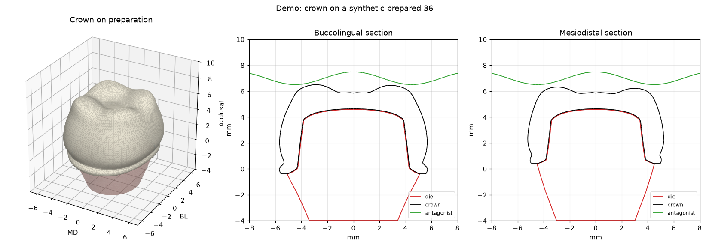

# crownai — автоматическое моделирование коронок

Инструмент строит полноанатомическую коронку по скану отпрепарированного зуба,
учитывает антагонист и **дообучается на ваших завершённых кейсах**. Работает
вместе с exocad DentalCAD через папку кейса.



## Что делает

1. **Линия препарирования** — определяется автоматически на отсегментированной
   культе (самая широкая точка в каждом сечении через ось) или берётся из файла.
2. **Внутренняя поверхность** — поверхность культи + цементный зазор
   (по умолчанию 50 мкм, у края плавно сужается до 10 мкм).
3. **Наружная анатомия** — из одного из источников:
   - встроенная параметрическая библиотека зубов (моляр, премоляр, клык, резцы);
   - **модель, обученная на ваших кейсах** (см. ниже);
   - статистическая модель формы (PCA), обученная на наборе STL коронок.
   Анатомия масштабируется под культю и плавно выходит из линии препарирования
   (профиль выхода без ступенек и нависаний).
4. **Окклюзия** — бугры срезаются под антагонист с заданным зазором.
5. **Минимальная толщина** — стенки ≥ 0.8 мм, окклюзионно ≥ 1.2 мм
   (настраивается), недостающая толщина добавляется снаружи.
6. **Экспорт** — герметичный (watertight) STL + JSON-отчёт контроля качества
   + PNG-превью с сечениями.

Около 5 секунд на зуб на обычном ПК.

## Установка

Нужен Python 3.10+ (Windows/macOS/Linux):

```bash
pip install -e ".[viz]"      # numpy + matplotlib для превью
pip install scipy            # необязательно: ускоряет расчёт толщины
```

## Быстрый старт

```bash
crownai demo --out-dir out/demo          # всё на синтетических данных
crownai design --prep die_36.stl --tooth 36 --antagonist upper.stl \
               --out crown_36.stl --report report.json --preview preview.png
```

Параметры: `--cement-gap`, `--margin-gap`, `--min-axial`, `--min-occlusal`,
`--clearance`, `--axis` (ось введения, по умолчанию `0,0,1`),
`--md-dir` (мезиодистальное направление, по умолчанию `1,0,0`),
`--margin` (файл точек линии препарирования `x y z` построчно).

## Работа с exocad

У exocad нет публичного SDK для плагинов — встроить модуль прямо в интерфейс
exocad можно только через партнёрскую программу exocad. Поэтому интеграция
идёт через **папку кейса** — так она работает с любой версией exocad:

1. В exocad экспортируйте кейс в папку-«входящие»: сканы в STL (культя /
   челюсть, антагонист) и, по возможности, линию препарирования
   (`margin_36.xyz` или `.pts`). Номера зубов берутся из XML кейса
   (`*.constructionInfo` / `*.dentalProject`) или из `--tooth`.
2. Запустите наблюдение за папкой:
   ```bash
   crownai exocad-watch D:\crownai\inbox --library D:\crownai\library
   ```
   Для каждого нового кейса в `<кейс>\crownai\` появятся `crown_36.stl`,
   отчёт и превью.
3. Импортируйте `crown_36.stl` в exocad как внешнюю модель и доработайте.
4. Экспортируйте **финальную** коронку обратно в папку кейса как
   `crownai\crown_36_final.stl` (или любой `*final*.stl`) — модуль
   автоматически добавит кейс в обучение.

Если скан — полная челюсть, нужен файл линии препарирования: по нему
культя вырезается из скана автоматически. Шаблоны имён файлов (`*prep*`,
`*die*`, `*antag*`, `*margin*` …) можно переопределить флагами
`--prep`, `--antagonist`, `--margin` в `crownai exocad-case`.

## Анатомия по соседним зубам

Главный принцип — повторить собственную анатомию пациента, как это делает техник:

- **Симметричный зуб** (для 33 — это 43) находится на скане челюсти и
  зеркально отражается на место препарирования. Для резцов и клыков его скан
  не копируется: по нему **подгоняются параметры анатомической модели зуба**
  (`crownai/anatomy_model.py`) — размеры по таблицам Уилера, контуры с каждой
  стороны (бугор и скаты клыка, контактные пункты, вестибулярный экватор,
  цингулюм, маргинальные валики и ямки), наклон. Модель одновременно обязана
  покрыть культю минимальной толщиной, шейка повторяет линию препарирования,
  выход из уступа — ровный пандус не круче 45°. Поэтому коронка всегда
  остаётся зубом, даже если скан соседа неполный или стёртый.
- **Соседние зубы** задают мезиодистальное направление (по дуге), ширину
  промежутка и **контактные пункты**: боковые поверхности коронки
  подводятся к соседям (зазор — `contact_gap`, по умолчанию 0).
- Если симметричного зуба нет, используется выученная анатомия или
  библиотека, но положение и ширина всё равно берутся от соседей.

Как находятся зубы на нераздельном скане: по карте высот ищутся вершины
бугров/режущих краёв, от препарирования они связываются в цепочку вдоль дуги,
а границы зубов определяются по сужению коронки в контактах (V-образные
амбразуры). Контралатеральный зуб позиции p — это (2p−1)-й зуб по цепочке
в мезиальную сторону.

**Проверка на реальном кейсе** (зуб 33, эталон — ваксап техника из exocad):

| Анатомия | Среднее отклонение от ваксапа | 90-й перцентиль |
| --- | --- | --- |
| библиотечный зуб | 0,73 мм | 1,97 мм |
| соседи + зеркальный 43 | 0,47 мм | 0,89 мм |
| анатомическая модель, подогнанная под 43 | **0,41 мм** | 0,96 мм |

## Функциональная окклюзия по Славичеку

Флаг `--slavicek` включает концепцию последовательного ведения
(sequential guidance) Р. Славичека:

- **Центрические контакты** — ближайшие бугры поднимаются до точечного
  контакта с антагонистом (без «площадок»).
- **Экскурсии** — антагонист проводится по протрузии, латеротрузии и
  медиотрузии (направления «окклюзионного компаса» из ориентации дуги);
  всё, что мешает движению, снимается. Угол ведения растёт от второго
  моляра к клыку на `sequence_step` (5°) на зуб, начиная с наклона
  суставного пути; медиотрузия круче на угол Фишера.
- Средние значения можно заменить данными аксиографии (CADIAX):
  `--condylar-inclination 42 --bennett 12`.
- **Ведение пациента по сканам** (как в occlusal fingerprint analysis):
  если есть скан той же челюсти, нижняя челюсть «проводится» по рельефу
  зубов с поиском столкновений — открывание на каждом шаге ровно такое,
  чтобы зубы не проникали друг в друга. Так из самих сканов получаются
  реальные углы протрузии, латеро- и медиотрузии и зубы, которые ведут.
  Клыки и резцы (ведущие) могут быть круче этого пути до угла концепции,
  премоляры и моляры (размыкающиеся) держатся под более пологим из двух.

```bash
crownai design-webview case.html --tooth 36 --slavicek --out crown.stl
crownai design-webview case.html --tooth 36 --slavicek --fix-bite --out crown.stl
crownai fix-bite --jaw lower.stl --antagonist upper.stl --out upper_fixed.stl
```

`fix-bite` исправляет прикус после сканирования (челюсти «проваливаются»
друг в друга или не смыкаются): антагонист сдвигается по оси окклюзии и
слегка наклоняется до смыкания без проникновения с распределёнными контактами.

Ограничение: оси вращения суставов не восстанавливаются (движение —
поступательное скольжение по рельефу в системе координат зуба, без
переноса лицевой дугой); углы задают допустимую крутизну, а не строят
ведущую поверхность клыка заново.

## Файлы exocad webview (HTML)

HTML-экспорт exocad («webview», без пароля) читается напрямую: все объекты
сцены — сканы челюстей, культи «NN: Препарирование», ваксапы, антагонисты —
извлекаются в миллиметрах в координатах exocad.

```bash
crownai webview case.html                       # список объектов (без ФИО пациента)
crownai webview case.html --export out/stl      # все объекты в STL
crownai design-webview case.html --tooth 33 --out crown_33.stl --preview p.png
crownai learn-webview archive/*.html --library lib   # обучение на ваксапах техника
```

`design-webview` сам находит культю зуба, скан той же челюсти (соседи),
антагонист (противоположная челюсть и её реставрации) и, если в сцене есть
ваксап этого зуба, сравнивает с ним результат (блок `reference` в отчёте).

## Обучение на ваших кейсах

Каждый одобренный техником кейс становится обучающим примером:
«параметры культи и линии препарирования» → «анатомия финальной коронки».

- До 20 кейсов на группу зубов — регрессия (устойчиво на малых данных).
- От 20 кейсов — нейросеть; при каждом новом кейсе она **дообучается от
  предыдущих весов**, а не учится заново.
- Форма всегда проецируется в пространство реальных коронок (PCA), поэтому
  модель не выдаёт «невозможных» зубов.

```bash
# автоматически (в режиме exocad-watch с --library) или вручную:
crownai learn-case D:\crownai\inbox\Case01 --library D:\crownai\library
# импорт архива старых работ:
crownai learn --library lib --crown final_36.stl --prep die_36.stl --tooth 36
# что выучено и насколько точно (кросс-валидация, мм):
crownai library lib --evaluate
# проектирование с выученной анатомией:
crownai design --prep die.stl --tooth 36 --library lib --out crown.stl
```

В отчёте поле `anatomy_source` показывает, откуда взята форма
(например `learned (mlp, 57 cases)`). История обучения — `library/history.jsonl`.

## Ограничения (v0.2)

- Автоопределение линии препарирования рассчитано на отсегментированную
  культю; для скана челюсти передайте линию из exocad.
- Поиск зубов на скане — геометрические правила, а не нейросеть: на сканах
  с сильной скученностью, без соседей или с большими дефектами он может
  ошибаться (тогда используется библиотека). Надёжная сегментация — следующий
  шаг, для неё нужна нейросеть и размеченные данные.
- Окклюзионные контакты с антагонистом пока только «не выше антагониста»,
  без моделирования фиссур под бугры антагониста.
- Только одиночные коронки (без мостов, вкладок, виниров).
- Результат — черновик для проверки техником, а не готовая к фрезеровке
  работа без контроля.

## Структура

| Модуль | Назначение |
| --- | --- |
| `crownai/design.py` | основной алгоритм построения коронки |
| `crownai/margin.py` | система координат зуба, линия препарирования |
| `crownai/anatomy.py` | библиотека зубов, статистическая модель формы |
| `crownai/anatomy_model.py` | анатомическая модель резцов и клыков, подгонка к пациенту |
| `crownai/learning.py` | библиотека кейсов, регрессия / нейросеть, дообучение |
| `crownai/exocad.py` | мост с exocad: разбор папки кейса, наблюдение, обучение |
| `crownai/webview.py` | чтение HTML-экспорта exocad (OpenCTM), разбор сцены |
| `crownai/arch.py` | соседние и симметричный зуб на скане челюсти |
| `crownai/metrics.py` | сравнение коронки с эталоном (ваксапом техника) |
| `crownai/occlusion.py` | окклюзия по Славичеку, коррекция прикуса |
| `crownai/mesh.py` | STL, трассировка лучей, геометрия (только numpy) |
| `crownai/viz.py` | превью и сечения |
| `crownai/synthetic.py` | синтетические сканы для демо и тестов |

Тесты: `pip install -e ".[dev]" && pytest`
