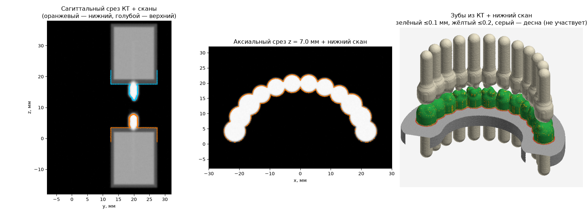

# Custom Case Designer

Приложение для Windows: КТ (КЛКТ), сканы челюстей и сегментация анатомии в
единых координатах, с экспортом в STL.

Сейчас готово вычислительное ядро: чтение КТ, совмещение сканов с КТ **по
геометрии зубов** и экспорт. Интерфейс приложения — следующий этап.



## Как работает совмещение

Скан челюсти и КТ сопоставляются только по коронкам зубов: эмаль и дентин
видны и там, и там, а десна в КТ почти не видна, и кость на скане не видна
вовсе.

1. **Пороги тканей** берутся из самого снимка (КЛКТ не откалиброван в HU):
   четырёхуровневый Оцу делит воксели на воздух, мягкие ткани, кость и зубы.
2. **Коронки в КТ** — участки поверхности зубов, за которыми мягкие ткани или
   воздух, а не кость. Они делятся на верхнюю и нижнюю челюсть: в координатах
   DICOM ось z направлена к голове, жевательные поверхности нижних зубов
   смотрят вверх, верхних — вниз.
3. **Начальное положение** находится само: скан поворачивается жевательной
   стороной к своей челюсти, перебирается поворот вокруг этой оси, лучший
   вариант уточняется. Челюсть скана определяется автоматически. Если
   автоматика не справилась, начальное положение задаётся тремя и более
   парами точек.
4. **Точная подгонка** — ICP «точка — плоскость» к коронкам в исходном
   разрешении КТ. Каждая точка коронки сдвигается на настоящую границу
   эмали — максимум перепада яркости, найденный с точностью до долей вокселя
   (кубическая интерполяция). Десна и всё, чего нет в КТ, отбрасывается по
   расстоянию.
5. **Сдвиг границы эмали** — у каждого аппарата КТ граница зуба из-за
   размытия лежит чуть снаружи или внутри настоящей поверхности, и скан
   садится выше или ниже, чем надо. Этот сдвиг находится вместе с положением
   скана (седьмой параметр подгонки) и учитывается.
6. **Контроль** — отклонение каждой точки скана от коронок КТ: среднее,
   90-й перцентиль, доля точек ближе 0.1 и 0.2 мм, цветная карта.
7. **Проверка скана** — скан делится на участки вдоль дуги, каждый
   подгоняется к КТ отдельно. Если участок сдвигается относительно остальных
   больше чем на 0.1 мм или почти не ложится на КТ, пользователь получает
   предупреждение: дуга, вероятно, искажена при склейке скана.

Частичные сканы (квадрант, сегмент) находят своё место на дуге автоматически.

## Ручная коррекция и обучение

Если автоматическое совмещение не устроило, положение скана правится вручную
(в интерфейсе — как в RealGUIDE). Для этого в ядре есть оценка точности любого
положения (`CaseCT.evaluate`) и уточнение от положения пользователя
(`CaseCT.register(start=...)`).

Принятые кейсы запоминаются в памяти совмещений (`learning.AlignmentMemory`,
файл JSON Lines): что предложила программа и где пользователь оставил скан.
Итоговое положение считается верным. Из памяти для каждого аппарата КТ
выучивается сдвиг границы эмали. Чем больше принятых кейсов, тем сильнее он
стабилизирует следующие совмещения, особенно на неполных сканах. Учимся только
на принятых и хорошо легших сканах. В памяти нет имён файлов и пациентов,
только аппарат, матрицы и показатели точности.

**Точность на синтетической челюсти** (воксель 0.3 мм, шум, размытие, повёрнутая
сетка вокселей, скан с десной в произвольном положении, граница зубов на КТ
раздута на 0.12 мм): ошибка относительно истинного положения не больше 0.01 мм. На реальных КТ
точность ограничена разрешением, артефактами от металла и подвижностью
пациента — её нужно проверить на настоящих кейсах.

## Командная строка

```
pip install -r requirements.txt
python -m casedesigner register КТ --scan upper.stl --scan lower.stl -o результат
```

| Параметр | Описание |
|---|---|
| `КТ` | папка DICOM (ищется самая длинная серия, в том числе во вложенных папках), `.dcm`, `.zip`, `.nii.gz`, `.mha`, `.nrrd` |
| `--scan` | скан челюсти (STL/PLY/OBJ), можно несколько |
| `--jaw СКАН=upper\|lower` | челюсть скана, если не хочется полагаться на автоопределение |
| `--pairs СКАН=ФАЙЛ` | пары точек для начального положения: строки `x y z  X Y Z` (точка на скане, та же точка в КТ, мм) |
| `--frame ct\|scan` | система координат результата: `ct` — пациента из DICOM (по умолчанию), `scan` — первого скана |
| `--ct-surfaces` | также выгрузить зубы и кость из КТ (по порогам) |
| `--models ПАПКА` | сегментировать КТ моделями ONNX (`anatomy/`, `teeth/`) и выгрузить структуры |
| `--memory ФАЙЛ` | память совмещений: применить выученную поправку аппарата КТ |
| `--accept` | результат проверен — запомнить его в `--memory` для обучения |

Сегментация без сканов: `python -m casedesigner segment КТ --models ПАПКА -o результат`.

В папке результата:

- `<скан>.stl` — сканы в выбранной системе координат;
- `<скан>_deviation.ply` — тот же скан, раскрашенный по отклонению от КТ
  (зелёный ≤ 0.1 мм, жёлтый ≤ 0.2 мм, красный больше, серый — не на коронке);
- `ct_teeth.stl`, `ct_bone.stl` — поверхности из КТ (с `--ct-surfaces`);
- `case.json` — матрицы 4×4 «исходный файл → результат» для каждого файла,
  матрицы «скан → КТ» и показатели точности.

## Тесты

```
pip install pytest
python -m pytest
```

Тесты строят синтетическую челюсть (обе челюсти, коронки, корни, кость,
десна) и проверяют чтение DICOM/NIfTI/архивов, уточнение границы, совмещение
обеих челюстей, совмещение по парам точек, экспорт в обеих системах координат
и командную строку.

## Лицензии

Используемые библиотеки и их лицензии — в [THIRD_PARTY_NOTICES.md](THIRD_PARTY_NOTICES.md).
