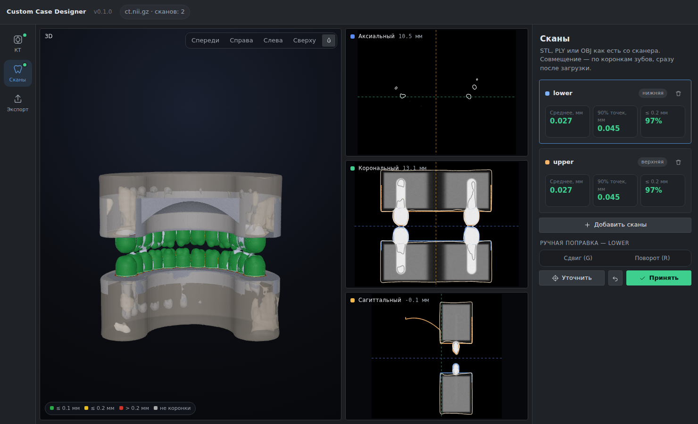
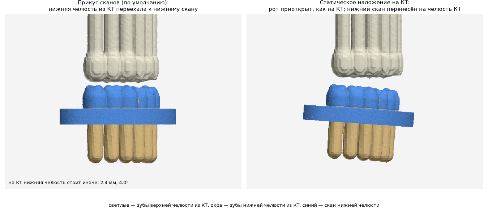

# Custom Case Designer

Приложение для Windows: КТ (КЛКТ), сканы челюстей и сегментация анатомии в
единых координатах, с экспортом в STL.



## Первая версия (0.1)

Только то, что нужно для работы: **сегментация КТ** и **совмещение сканов с
КТ**, затем **экспорт всех 3D-объектов в единых координатах**. Три шага слева:

1. **КТ** — папка DICOM, архив (zip, 7z, rar, tar, tar.gz) или файл NIfTI, MHA, NRRD. Если серий несколько, программа спросит, какую открыть. «Сегментировать»:
   зубы с номерами FDI, челюсти, каналы, пазухи, дыхательные пути, импланты;
   группы с переключением видимости. «Что сегментировать…» — какие части
   считать (лишние модели не запускаются, выбор запоминается). Модели сегментации скачиваются здесь же
   кнопкой «Скачать модели» (один раз, ~350 МБ, с докачкой и проверкой
   контрольной суммы).
2. **Сканы** — STL, PLY, OBJ как есть со сканера (внутриротового или
   настольного — гипсовые модели с цоколем). Совмещение по коронкам зубов
   сразу после загрузки (опора — зубы из сегментации, поэтому КТ лучше
   сегментировать до сканов; совмещённые раньше сканы после сегментации
   совмещаются заново): метрики, карта отклонений, предупреждения (под
   значком ⚠ — по нажатию). Устраивает — «Принять». Не устраивает —
   «Скорректировать»: на срезах, где контур скана видно на КТ, появляется
   кольцо-манипулятор — внутри кольца тянуть — сдвиг в плоскости среза, за
   кольцо — поворот вокруг его центра; стрелки — точный сдвиг 0.05 мм,
   Ctrl+←/→ — поворот 0.1° (с Shift — 0.25 мм и 0.5°); «Уточнить» — подогнать
   по коронкам от этого положения. «Сохранить поправку» запоминает положение
   пользователя: по каждому аппарату КТ программа выводит сдвиг границы эмали
   и с трёх хорошо легших кейсов применяет его к следующим совмещениям —
   сразу, в том же кейсе; плохо легшее положение в обучение не берётся.
   Программа сообщает, чему научилась. У каждого объекта и группы — кнопка
   прозрачности в 3D.
3. **Экспорт** — STL всех видимых объектов (сканы и структуры КТ) и
   `case.json` с матрицами в одной системе координат: сканера (в ней exocad
   открывает сканы, прикус — со сканов) или КТ (DICOM). Без сканов —
   структуры КТ в координатах КТ.

**Кейс** сохраняется в один файл `.ccdcase` («Сохранить», Ctrl+S; «Открыть»,
Ctrl+O; недавние кейсы — на стартовом экране): путь к КТ, сканы (сетки —
внутри файла) с положениями и тем, что предлагала программа, структуры
сегментации, окно КТ. При открытии сегментация не повторяется; если КТ
переместили, программа спросит, где он теперь.

**Срезы:** колесо — масштаб, нажатое колесо — сдвиг, правая кнопка — яркость и
контраст (вбок — контраст, вверх-вниз — яркость), наборы окна «Авто», «Зубы»,
«Кость», «Мягкие ткани» — в углу среза; двойной щелчок — развернуть срез (или
3D) на всю рабочую область, Esc — обратно. Контур скана на срезе окрашен по
отклонению от КТ, как карта в 3D: зелёный — до 0.1 мм, жёлтый — до 0.2 мм,
красный — больше, серый — не коронки. В режиме коррекции Ctrl+Z / Ctrl+Y —
шаг назад и вперёд.

Ориентиры, плоскости, артикуляторы и движения челюсти в интерфейс первой
версии не входят — они есть в ядре и в командной строке (ниже).

### Запуск на ПК (Windows 10/11)

Из исходников: установить Python 3.12 с python.org (галочка «Add python.exe
to PATH») и запустить `packaging\run_windows.bat` — при первом запуске он
ставит библиотеки в `.venv`, дальше сразу открывает программу. То же вручную:

```
pip install -r packaging/requirements-app.txt
python -m casedesigner.app
```

Сборка exe: `packaging\build_windows.bat` — папка `dist\CustomCaseDesigner` с
`CustomCaseDesigner.exe` (PyInstaller; `onnxruntime-directml` — расчёт на
любой видеокарте с DirectX 12, без неё — на процессоре). Окно — Edge
WebView2 (есть в Windows 10/11); без него интерфейс откроется в браузере.
Всё считается локально, сервер слушает только 127.0.0.1; в сеть программа
ходит только за моделями.

**Модели.** Кнопка скачивает переведённые в ONNX модели TotalSegmentator из
релиза `models-v1` этого репозитория (файлы `teeth.onnx`,
`craniofacial.onnx`, `cavities.onnx`; размеры и SHA-256 — в
`casedesigner/model_store.py`). Кладутся рядом с программой, а если туда
нельзя писать — в `%LOCALAPPDATA%\CustomCaseDesigner\models`. Другой
источник — переменная `CCD_MODELS_URL`. Перевести модели заново (нужны
PyTorch и nnU-Net): `python tools/prepare_models.py models`, затем
`python -m casedesigner.model_store models` — новые размеры и суммы.

## Как работает совмещение

Скан челюсти и КТ сопоставляются только по коронкам зубов: эмаль и дентин
видны и там, и там, а десна в КТ почти не видна, и кость на скане не видна
вовсе.

1. **Пороги тканей** берутся из самого снимка (КЛКТ не откалиброван в HU):
   четырёхуровневый Оцу делит воксели на воздух, мягкие ткани, кость и зубы.
2. **Коронки — и в КТ, и на скане.** Полезна только коронковая часть зуба:
   корни в КТ и десна с нёбом на скане бесполезны. В КТ коронки — участки
   поверхности зубов, за которыми мягкие ткани или воздух, а не кость. На
   скане — всё, что не глубже высоты коронки от жевательной плоскости (через
   вершины бугров); нёбо и глубокая десна отсекаются, а десна у самих зубов
   отсекается совмещением. Коронки КТ делятся на верхнюю и нижнюю челюсть:
   в координатах DICOM ось z направлена к голове, жевательные поверхности
   нижних зубов смотрят вверх, верхних — вниз.
   **С сегментацией** опора — зубы из неё: выбор челюсти и начальный поиск
   идут по поверхности зубов каждой челюсти, точная подгонка — по границе
   эмали только у этих зубов. По одним порогам на КЛКТ с большим полем
   «коронкой» оказывается и тонкая кость у воздуха (носовые раковины,
   стенки пазух): скан садится со сдвигом вдоль дуги на несколько
   миллиметров или не на ту челюсть, а метрики отклонения этого не видят.
   Без сегментации у скана предупреждение об этом.
3. **Начальное положение** находится само: скан поворачивается жевательной
   стороной к своей челюсти, перебирается поворот вокруг этой оси, лучший
   вариант уточняется. Челюсть скана определяется автоматически. Если
   автоматика не справилась, начальное положение задаётся тремя и более
   парами точек.
4. **Точная подгонка** — ICP «точка — плоскость» к коронкам в исходном
   разрешении КТ. Каждая точка коронки сдвигается на настоящую границу
   эмали — максимум перепада яркости, найденный с точностью до долей вокселя
   (кубическая интерполяция). Десна и всё, чего нет в КТ, отбрасывается по
   расстоянию.
5. **Сдвиг границы эмали** — у каждого аппарата КТ граница зуба из-за
   размытия лежит чуть снаружи или внутри настоящей поверхности, и скан
   садится выше или ниже, чем надо. Этот сдвиг находится вместе с положением
   скана (седьмой параметр подгонки) и учитывается.
6. **Контроль** — отклонение каждой точки скана от коронок КТ: среднее,
   90-й перцентиль, доля точек ближе 0.1 и 0.2 мм, цветная карта.
7. **Проверка скана** — скан делится на участки вдоль дуги, каждый
   подгоняется к КТ отдельно. Если участок сдвигается относительно остальных
   больше чем на 0.1 мм или почти не ложится на КТ, пользователь получает
   предупреждение: дуга, вероятно, искажена при склейке скана.

Частичные сканы (квадрант, сегмент) находят своё место на дуге автоматически.

## Сегментация КТ

Готовые открытые модели TotalSegmentator, переведённые в ONNX: зубы по
отдельности с номерами FDI и пульпой, верхняя и нижняя челюсть, каналы,
пазухи, глотка, полость носа, нёбо, импланты, коронки, мосты. Подробно, с
лицензиями и проверкой на реальном КЛКТ — [docs/models.md](docs/models.md).

В приложении модели скачиваются кнопкой (см. «Первая версия»). Перевести
их из исходных весов самому (один раз, нужны PyTorch и nnU-Net):

```
pip install torch nnunetv2
python tools/prepare_models.py модели
```

Дальше приложению хватает ONNX Runtime (на Windows с видеокартой —
`onnxruntime-directml`):

```
python -m casedesigner segment КТ --models модели -o результат
```

## Ручная коррекция и обучение

Если автоматическое совмещение не устроило, положение скана правится вручную
(в интерфейсе — как в RealGUIDE). Для этого в ядре есть оценка точности любого
положения (`CaseCT.evaluate`) и уточнение от положения пользователя
(`CaseCT.register(start=...)`).

Принятые кейсы запоминаются в памяти совмещений (`learning.AlignmentMemory`,
файл JSON Lines): что предложила программа и где пользователь оставил скан.
Итоговое положение считается верным. Из памяти для каждого аппарата КТ
выучивается сдвиг границы эмали. Чем больше принятых кейсов, тем сильнее он
стабилизирует следующие совмещения, особенно на неполных сканах. Учимся только
на принятых и хорошо легших сканах. В памяти нет имён файлов и пациентов,
только аппарат, матрицы и показатели точности.

**Точность на синтетической челюсти** (воксель 0.3 мм, шум, размытие, повёрнутая
сетка вокселей, скан с десной в произвольном положении, граница зубов на КТ
раздута на 0.12 мм): ошибка относительно истинного положения не больше 0.01 мм. На реальных КТ
точность ограничена разрешением, артефактами от металла и подвижностью
пациента.

**Реальные КЛКТ** (два кейса, HDXWILL DENTRI-C, воксель 0.2 мм, поле
160×160×144 и 160×160×46 мм; сканы верхней и нижней челюсти). Только по
порогам оба кейса сели неверно: в первом нижний скан — на верхнюю челюсть,
верхний — на 3.7 мм вдоль дуги, во втором верхний скан — на нижнюю челюсть,
при этом среднее отклонение «хорошее» (0.19–0.22 мм). С сегментацией все
четыре скана на своих челюстях: среднее отклонение коронок 0.11–0.15 мм,
90% точек ближе 0.26–0.33 мм; до поверхности зубов из сегментации (независимая
проверка) — медиана 0.27–0.37 мм против 1.2 мм у неверного положения.

## Движения челюсти и артикулятор

Задел (подробно — [docs/motion.md](docs/motion.md)):

- **анализ реальных движений** из кейсов P-ART и других систем записи
  (Zebris, Modjaw, Medit, CADIAX, открытый JawTrackingSystem…): чтение
  выгрузки (форматы закрыты, поэтому — разведкой: положения или маркеры в XML,
  таблицы CSV/ASCII, HDF5, пути шарнирных точек мыщелков), шарнирная ось, пути
  резцовой точки и мыщелков, ССП, угол Беннетта, немедленный боковой сдвиг,
  угол Фишера, ведение зубами — числа для настройки артикулятора;
- **свой виртуальный артикулятор**: движения по шарнирной оси и суставным
  путям, передняя часть — по реальным зубам из сканов (со стёртостью);
- **ССП по полночерепному КТ**: головка мыщелка катится по профилю суставного
  бугорка в сечении через мыщелок, наклон пути — от выбранной плоскости.

```
python -m casedesigner motion выгрузка_P-ART.zip -o отчёт
python -m casedesigner motion выгрузка_P-ART.zip --inspect   # структура без значений и имён
python -m casedesigner motion cadiax.txt --axes=-y,x,-z      # пути мыщелков: оси прибора — вправо, вперёд, вверх
python -m casedesigner motion запись.csv --split --smooth   # сплошная запись: разделить на движения, сгладить шум
```


## Командная строка

```
pip install -r requirements.txt
python -m casedesigner register КТ --scan upper.stl --scan lower.stl -o результат
```

| Параметр | Описание |
|---|---|
| `КТ` | папка DICOM (серий несколько — выбор, по умолчанию самая длинная; в том числе во вложенных папках), `.dcm`, архив `.zip`, `.tar`, `.tar.gz`/`.tgz`, `.tar.xz`, `.7z`, `.rar` (7z и rar — через tar.exe Windows 10/11; внутри DICOM или NIfTI/MHA/NRRD), `.nii.gz`, `.mha`, `.nrrd` |
| `--scan` | скан челюсти (STL/PLY/OBJ), можно несколько |
| `--jaw СКАН=upper\|lower` | челюсть скана, если не хочется полагаться на автоопределение |
| `--pairs СКАН=ФАЙЛ` | пары точек для начального положения: строки `x y z  X Y Z` (точка на скане, та же точка в КТ, мм) |
| `--bite scan\|ct` | чей прикус (см. ниже), по умолчанию `scan` — прикус сканов |
| `--frame exocad\|dicom` | система координат: `exocad` — сканера (по умолчанию), `dicom` — пациента из DICOM (только с `--bite ct`) |
| `--ct-surfaces` | также выгрузить зубы и кость из КТ (по порогам) |
| `--models ПАПКА` | сегментировать КТ моделями ONNX (см. «Сегментация КТ») и выгрузить структуры; зубы из сегментации — опора совмещения |
| `--memory ФАЙЛ` | память совмещений: применить выученную поправку аппарата КТ |
| `--accept` | результат проверен — запомнить его в `--memory` для обучения |

Сегментация без сканов: `python -m casedesigner segment КТ --models ПАПКА -o результат`.
Записи движений: `python -m casedesigner motion ВЫГРУЗКА -o отчёт` (см. «Движения челюсти и артикулятор»).

**Прикус и система координат.** Всё готовится для exocad: результат по
умолчанию в координатах сканера — в них exocad открывает сканы, поэтому КТ и
сегменты встают там рядом со сканами на свои места. Опорный скан — верхний.



- `--bite scan` (по умолчанию) — **прикус сканов**. Прикус на КТ обычно другой
  (рот приоткрыт, прикусной валик), а в приоритете прикус со сканера. Сканы
  стоят как пришли со сканера. Структуры из КТ, связанные с нижней челюстью
  (нижняя челюсть, нижние зубы, канал, импланты нижней челюсти), переезжают
  к нижнему скану, остальное — к верхнему. Смешанные объекты (импланты,
  поверхности по порогам) делятся по челюстям. В отчёте — насколько нижняя
  челюсть на КТ стоит иначе, чем на сканах. Если сканы выгружены по
  отдельности и не стоят в прикусе, нижний ставится по КТ (с пометкой).
- `--bite ct` — **статическое наложение на КТ**: всё стоит как на КТ, сканы
  переносятся на свои челюсти. Только в этом режиме можно выбрать
  `--frame dicom` — координаты пациента из DICOM (мм, LPS).

В папке результата:

- `<скан>.stl` — сканы в выбранной системе координат;
- `<скан>_deviation.ply` — тот же скан, раскрашенный по отклонению от КТ
  (зелёный ≤ 0.1 мм, жёлтый ≤ 0.2 мм, красный больше, серый — не на коронке);
- `ct_teeth.stl`, `ct_bone.stl` — поверхности из КТ (с `--ct-surfaces`);
- `case.json` — матрицы 4×4 «исходный файл → результат» для каждого файла,
  матрицы «скан → КТ», показатели точности, участки дуги и предупреждения.

## Тесты

```
pip install pytest
python -m pytest
```

**Проверка на своих кейсах.** Реальных данных в репозитории нет, но их
можно проверять у себя: папка с HTML-экспортами exocad (без пароля),
`tests/test_private_cases.py` прогоняет по каждому анализ динамики и
сравнивает с запомненным. Запомненное — `ccd_expected.json` в той же папке:
только числа по отпечатку файла, без имён.

```
set CCD_PRIVATE_CASES=D:\cases
set CCD_RECORD=1
python -m pytest tests/test_private_cases.py     # первый раз — запомнить
set CCD_RECORD=
python -m pytest tests/test_private_cases.py     # после изменений — сравнить
```

Тесты строят синтетическую челюсть (обе челюсти, коронки, корни, кость,
десна) и проверяют чтение DICOM/NIfTI/архивов, уточнение границы, совмещение
обеих челюстей, совмещение по парам точек, экспорт в обеих системах координат
и командную строку. Для движений — синтетические записи в разных раскладках
XML и CSV, круг «артикулятор → анализ», ведение по зубам и ССП по профилю
бугорка.

## Лицензии

Используемые библиотеки и их лицензии — в [THIRD_PARTY_NOTICES.md](THIRD_PARTY_NOTICES.md).
