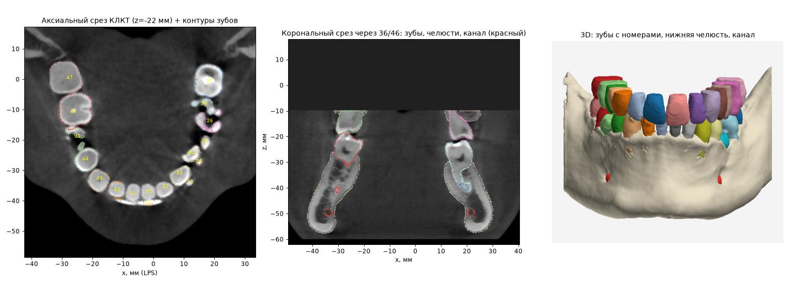

# Готовые модели сегментации: что можно использовать

**Проект некоммерческий**, поэтому используются и компоненты под
некоммерческими лицензиями (CC BY-NC, CC BY-NC-SA) — с указанием авторов и
соблюдением остальных условий этих лицензий.

## Что подключено

Три модели TotalSegmentator переведены в ONNX (`tools/prepare_models.py`
скачивает веса и переводит их; описание выходов — `tools/models/*.json`):

| Модель приложения | Источник | Что берётся | Область расчёта | Приоритет |
|---|---|---|---|---|
| `craniofacial` | TS `craniofacial_structures` (КТ) | нижняя челюсть целиком, череп, лобные пазухи | весь снимок | 1 |
| `teeth` | TS `teeth` (КЛКТ, ToothFairy3) | зубы по отдельности с номерами FDI и пульпой, пульпа отдельно, зубы верхней и нижней челюсти, верхняя челюсть, нижняя челюсть (если нет craniofacial), нижнечелюстной, резцовые и язычный каналы, гайморовы пазухи, глотка, импланты, коронки, мосты | зубные ряды (по плотности) + 12 мм в стороны и 30 мм вверх/вниз | 2 |
| `cavities` | TS `head_glands_cavities` (КТ) | полость носа, мягкое и твёрдое нёбо, носо-, рото- и гортаноглотка | весь снимок | 3 |

Одна и та же структура берётся из модели с меньшим приоритетом. ONNX
сверяется с PyTorch при переводе: метки совпадают в ≥ 99.999% вокселей.

### Проверка на реальном КЛКТ

Тестовый снимок проекта AMASSS (DCBIA-OrthoLab, релиз GitHub, 512×512×365,
0.33 мм; в репозиторий не входит):

- найдены 28 зубов (11–17, 21–27, 31–37, 41–47) с номерами FDI; стороны
  пациента верны; контуры зубов лежат на границах на срезах;
- яркость КТ на поверхности зуба 36 — посередине перепада (внутри 2230, на
  поверхности 1805, снаружи 845): ориентация и координаты верны;
- нижняя челюсть: модель `teeth` обрезает её по своей области, `craniofacial`
  даёт её целиком с ветвями — поэтому нижняя челюсть берётся из `craniofacial`;
- каналы лежат внутри кости; найдены глотка и мягкое нёбо;
- полость носа и пазухи на этом снимке не найдены — они вне поля зрения
  (снимок заканчивается чуть выше верхних зубов); на снимках с большим полем
  их нужно проверить отдельно, особенно модели `craniofacial` и `cavities`,
  обученные на обычной КТ;
- время на процессоре (4 ядра): 9 минут, из них 6.5 — `craniofacial` по всему
  снимку; на видеокарте — в разы быстрее.

Цель — получить набор структур как у OdentAI (кости, отдельные зубы с
номерами FDI, каналы, пазухи, воздухоносные пути, импланты, коронки, мосты) на
готовых открытых весах и дообучать по минимуму. Ниже — найденные модели с
лицензиями и авторами. Проверено 2026-10-03.

Все модели — nnU-Net v2 (PyTorch). В приложение они идут после однократного
перевода в ONNX (см. «Что дальше»).

## Сводка

| Модель | Что сегментирует | Обучена на | Лицензия весов | Коммерческое использование |
|---|---|---|---|---|
| **TotalSegmentator `teeth`** | 77 классов: нижняя и верхняя челюсть, левый и правый нижнечелюстные каналы, гайморовы пазухи, глотка, мосты, коронки, импланты, 32 зуба с номерами FDI, резцовые каналы, язычный канал, пульпа каждого зуба | ToothFairy3: 532 КЛКТ, 0.3 мм | Apache-2.0 (по README TotalSegmentator) | **под вопросом**: набор данных ToothFairy3 — CC BY-NC-SA |
| **ToothSeg** (MIC-DKFZ) | отдельные зубы с номерами FDI (экземпляры) | ToothFairy2 | CC BY 4.0 (Zenodo) | да, с указанием авторства; данные ToothFairy2 — CC BY-SA |
| **DentalSegmentator** | верхний отдел черепа с верхней челюстью, нижняя челюсть, зубы верхней челюсти, зубы нижней челюсти, нижнечелюстной канал | КТ и КЛКТ | CC BY 4.0 | да, с указанием авторства |
| **TotalSegmentator `craniofacial_structures`** | нижняя челюсть, зубы нижние, череп, голова, гайморовы пазухи, лобные пазухи, зубы верхние | 384 КТ, 0.5 мм | Apache-2.0 | да |
| **TotalSegmentator `head_glands_cavities`** | в том числе полость носа (левая/правая), носоглотка, ротоглотка, гортаноглотка, мягкое нёбо, твёрдое нёбо | 492 КТ | Apache-2.0 | да |

Модели `craniofacial_structures` и `head_glands_cavities` обучены на обычной
КТ (в единицах HU), а не на КЛКТ: на КЛКТ их нужно проверить и, возможно,
дообучить.

## Покрытие набора структур

| Структура | Основной источник | Запасной |
|---|---|---|
| нижняя челюсть | TS `teeth` (`lower_jawbone`) | DentalSegmentator, TS `craniofacial_structures` |
| верхняя челюсть / череп | TS `teeth` (`upper_jawbone`), TS `craniofacial_structures` (`skull`) | DentalSegmentator |
| зубы верхней / нижней челюсти | объединение зубов 1x–2x / 3x–4x из TS `teeth` | DentalSegmentator |
| нижнечелюстной канал | TS `teeth` (левый + правый) | DentalSegmentator |
| гайморовы пазухи | TS `teeth` (левая + правая) | TS `craniofacial_structures` |
| полость носа | TS `head_glands_cavities` (левая + правая) | — |
| глотка | TS `teeth` (`pharynx`) | TS `head_glands_cavities` (носо-, рото-, гортаноглотка) |
| мягкое нёбо | TS `head_glands_cavities` | — |
| зубы по отдельности (FDI 11–48) | TS `teeth` | ToothSeg |
| импланты, коронки, мосты | TS `teeth` | — |
| дополнительно: пульпа зубов, резцовые и язычный каналы | TS `teeth` | — |

## Подробно

### TotalSegmentator — задачи `teeth`, `craniofacial_structures`, `head_glands_cavities`

- Код и описание: https://github.com/wasserth/TotalSegmentator (Apache-2.0).
- В README эти задачи перечислены в разделе «Openly available for any usage
  (Apache-2.0 license)».
- Веса (релизы GitHub, по 230 МБ, скачиваются без регистрации):
  - `teeth`: https://github.com/wasserth/TotalSegmentator/releases/download/v2.5.0-weights/Dataset113_ToothFairy3.zip
    — nnU-Net `3d_lowres_high`, шаг 0.5 мм, вход «CBCT»;
  - `craniofacial_structures`: https://github.com/wasserth/TotalSegmentator/releases/download/v2.5.0-weights/Dataset115_mandible.zip
    — `3d_fullres`, шаг 0.5 мм, окно 112×160×128, вход «CT»;
  - `head_glands_cavities`: https://github.com/wasserth/TotalSegmentator/releases/download/v2.3.0-weights/Dataset775_head_glands_cavities_492subj.zip
    — `3d_fullres_high`, шаг 1.0×0.75×0.75 мм, вход «CT».
- Цитировать: Wasserthal J. et al., "TotalSegmentator: Robust Segmentation of
  104 Anatomic Structures in CT Images", *Radiology: Artificial Intelligence*
  (2023); для `teeth` — Bolelli F. et al., "Segmenting Maxillofacial
  Structures in CBCT Volumes", CVPR 2025; для `craniofacial_structures` —
  статья в *International Journal of Oral and Maxillofacial Surgery* (2025),
  https://www.ijoms.com/article/S0901-5027(25)01499-7/fulltext; для
  `head_glands_cavities` — https://www.mdpi.com/2072-6694/16/2/415.
- **Риск для коммерческого продукта:** модель `teeth` обучена на ToothFairy3,
  а он распространяется под CC BY-NC-SA (некоммерческое использование).
  TotalSegmentator выпускает сами веса под Apache-2.0, но распространяется ли
  ограничение данных на обученную модель — юридический вопрос. Для
  коммерческой версии — консультация юриста или замена на ToothSeg / своё
  дообучение на данных с разрешающей лицензией.

### ToothSeg (MIC-DKFZ)

- Код: https://github.com/MIC-DKFZ/ToothSeg (Apache-2.0).
- Веса: https://zenodo.org/records/14893540 — «Model Checkpoints for ToothSeg:
  A Self-Correcting Deep Learning Approach for Robust Tooth Instance
  Segmentation and Numbering in CBCT», CC BY 4.0; авторы Isensee F.,
  van Nistelrooij N., Krämer L., Vinayahalingam S. и др. (2025). Обучено на
  ToothFairy2 (CC BY-SA).
- Состав архива ещё не проверен: Zenodo закрыт сетевой политикой окружения.

### DentalSegmentator

- Веса: https://zenodo.org/records/10829675, CC BY 4.0.
- Цитировать: Dot G. et al., "DentalSegmentator: robust open source deep
  learning-based CT and CBCT image segmentation", *Journal of Dentistry* (2024).
- Не скачан: Zenodo закрыт сетевой политикой окружения.

## Сегментация зубов на внутриротовых сканах

Для совмещения со КТ нейросеть на скане не обязательна: коронки на скане
выделяются по форме (`casedesigner/scan_teeth.py`), а окончательно — по тому,
что легло на коронки КТ. Нейросеть пригодится для нумерации зубов на скане и
для разделения коронок и десны на сканах без КТ. Найденные модели:

| Модель | Что делает | Код | Веса | Данные обучения | Итог |
|---|---|---|---|---|---|
| **DentalModelSeg / CrownSegmentation** (DCBIA-OrthoLab, UNC + Univ. of Michigan) | зубы с номерами (Universal или FDI) и десна, верхняя и нижняя челюсть | Apache-2.0 (https://github.com/DCBIA-OrthoLab/SlicerDentalModelSeg) | релиз https://github.com/DCBIA-OrthoLab/Fly-by-CNN/releases/tag/3.0 — **лицензия не указана** (в репозитории Fly-by-CNN нет файла LICENSE) | данные челленджа MICCAI 3DTeethSeg | лучший кандидат; нужен письменный ответ авторов о лицензии весов |
| **MeshSegNet** (Lian C., Wu T.-H.) | 14 зубов и десна | MIT (https://github.com/Tai-Hsien/MeshSegNet) | в репозитории, под той же MIT | небольшой собственный набор авторов | лицензия чистая, но модель слабая для чужих сканеров |
| **TSegFormer** (Xiong H. и др., MICCAI 2023) | зубы и десна | MIT (https://github.com/huiminxiong/TSegFormer) | публичных весов не нашёл | — | только код |
| **ToothGroupNetwork** (победитель 3DTeethSeg'22) | зубы с номерами и десна | лицензии нет (https://github.com/limhoyeon/ToothGroupNetwork) | Google Drive, без лицензии | 3DTeethSeg | без разрешения авторов использовать нельзя |
| **OralSeg** | экземпляры зубов | Apache-2.0 | только некоммерческое использование | — | не подходит для коммерции |

Набор данных **Teeth3DS+** (1800 сканов, 900 пациентов) по описанию
бенчмарка распространяется под CC BY 4.0, но у данных челленджа
3DTeethSeg'22 в репозитории указана CC BY-NC-ND 4.0 — лицензию нужно уточнить
на странице набора. Если CC BY 4.0 подтвердится, на нём можно обучить свою
модель для коммерческого продукта с указанием авторства.

## Чем не пользуемся

- **OdentAI** — для движка и весов не указана лицензия, разрешающая
  переиспользование.
- Задачи TotalSegmentator из раздела «Available with a license» — платные
  для коммерческого использования.

## Что дальше

1. Перевести веса nnU-Net в ONNX (нужны PyTorch и nnU-Net один раз, на любой
   машине) и проверить, что ONNX даёт те же ответы, что PyTorch.
2. Проверить модели на настоящих КЛКТ, особенно обученные на КТ.
3. Дообучить только то, что окажется слабым (скорее всего полость носа и
   мягкое нёбо на КЛКТ), начиная с этих же весов.
