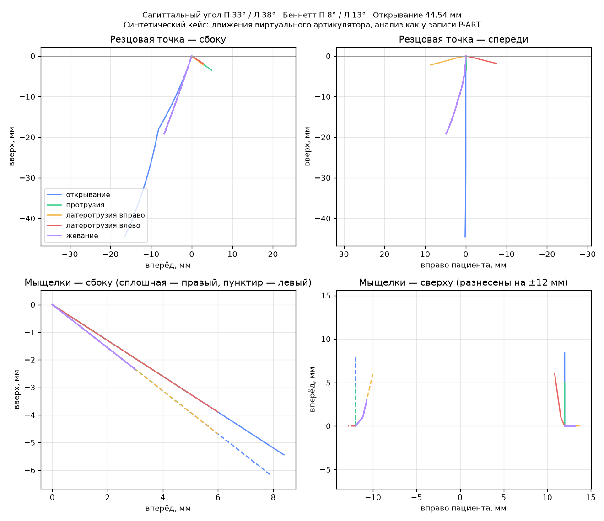
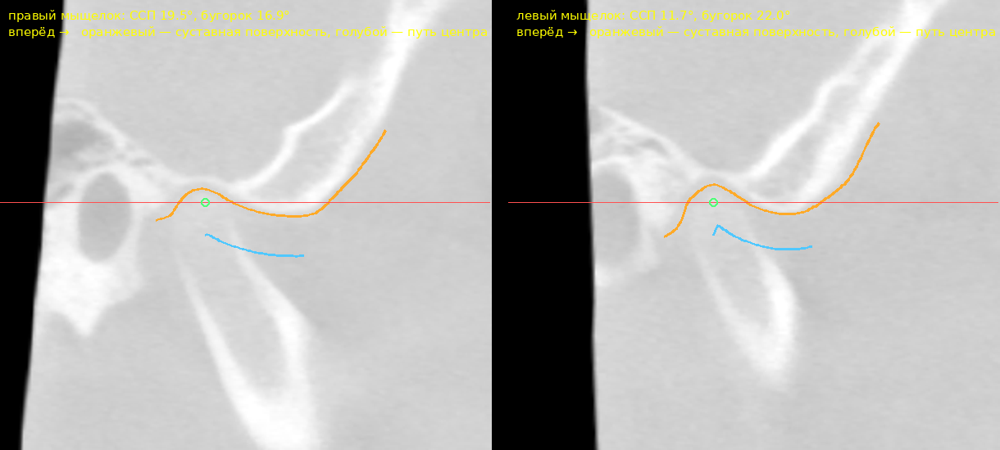

# Движения челюсти и виртуальный артикулятор



Задел под три задачи:

1. **анализ реальных движений** из кейсов P-ART и других систем записи
   (`casedesigner/motion.py`);
2. **свой виртуальный артикулятор** — движения по шарнирной оси и суставным
   путям с ведением по реальным зубам (`casedesigner/kinematics.py`);
3. **углы ССП и ведения из данных пациента** — из полночерепного КТ при
   правильном монтаже и из сканов зубов (`casedesigner/guidance.py`).

Записи P-ART — эталон для 2 и 3: на кейсах, где есть и запись, и КТ, и
сканы, видно, насколько оценка по анатомии расходится с реальным путём.

## P-ART

P-ART (P.Art) — цифровой аксиограф Prosystom / SDI Matrix. Для exocad он
выгружает модели челюстей и XML с записанными движениями нижней челюсти
(открывание, протрузия, латеротрузии, жевание) и значениями углов; exocad
читает их модулем Jaw Motion Import (среди поддерживаемых — Proaxis от
Prosystom). Описания формата в открытом доступе нет.

Поэтому чтение сделано «разведкой» и проверено на нескольких раскладках:

| Что ищется | Примеры |
|---|---|
| серия одинаковых элементов (≥ 5), в каждом — положение | `<Frame>…</Frame>` × N |
| положение — 16 или 12 чисел в тексте, по строкам или по столбцам | `<Frame time="0.02">1 0 0 0 …</Frame>` |
| ячейки матрицы | `<_00>…</_00>` … `<_33>`, `m00`…`m33`, `m11`…`m44` |
| смещение + кватернион или углы | `<Position x y z/>` + `<Orientation w x y z/>`; `rx ry rz` (градусы, XYZ) |
| два тела в кадре — нижняя относительно верхней | `<Body name="UpperJaw">`, `<Body name="LowerJaw">` |
| время | атрибут или элемент `time`, `t`, `timestamp`, `ms`…; иначе `fps`/`rate` у записи; иначе номера кадров |
| единицы | атрибут `unit(s)`; без него смещения меньше 0.2 при повороте больше 5° считаются метрами |
| таблицы CSV/TXT | строка на кадр: 16 или 12 чисел, впереди может стоять время; десятичная запятая тоже |

Прочие числа файла (углы, точки, настройки) сохраняются в отчёт как есть — по
ним сверяется формат. Личное (пациент, клиника, имена, даты) не читается.

**Допущение, которое проверяется на образце:** положения — это положения
нижней челюсти относительно верхней в координатах выгруженных моделей (так
exocad двигает нижнюю модель).

### Что нужно для точного чтения

Одна выгрузка P-ART (папка или архив). Если её нельзя передавать, хватит
вывода

```
python -m casedesigner motion выгрузка.zip --inspect
```

— это состав файлов и структура XML: теги, атрибуты, сколько раз повторяются,
сколько чисел внутри. Значения, имена и даты не выводятся.

## Другие системы записи движений

Модуль exocad Jaw Motion Import принимает данные Zebris JMA, SDI Matrix
(P-ART), OXO, Modjaw, ITAKA и Gamma CADIAX; Zebris и Modjaw передают их в
exocad в XML. Форматы открыто не описаны — ни у одной системы. Что известно
из открытых источников и что из этого читает ядро:

| Система | Что известно открыто | Что читается | Проверено |
|---|---|---|---|
| SDI Matrix / P-ART (Prosystom) | XML для exocad | положения челюсти по кадрам (разведка, см. выше) | синтетика |
| Zebris JMA / JMA Optic | XML для exocad; по описанию — координаты маркеров челюсти по кадрам и их расположение в окклюзии | маркеры → положения челюсти; или положения | синтетика |
| Medit i700 (запись движений) | XML: данные движения и исходное положение скана | так же, как Zebris | синтетика |
| Modjaw, OXO, ITAKA | XML для exocad | разведка: положения или маркеры | — |
| Gamma CADIAX | ASCII/CSV из CADIAX Analyzer; XML для exocad | таблицы с заголовками; пути шарнирных точек мыщелков — углы | синтетика |
| KaVo ARCUSdigma, Planmeca 4D Jaw Motion, Bioresearch JT-3D | сведений о формате не нашли | если выгрузка в XML/CSV/ASCII — разведкой | — |
| SICAT JMT+ | собственный `.jmtxd` (читают Cerec/inLab) | не читается — нужна выгрузка в открытом виде | — |
| JawTrackingSystem (открытый трекер) | CSV «tx ty tz qw qx qy qz» без заголовка; HDF5: группы `translations`, `rotations`, атрибуты `sample_rate`, `unit` | точно, по описанию формата в проекте | синтетика |

Как читаются данные, которых нет в разделе P-ART:

- **Маркеры.** Кадр, в котором вместо положения — точки (`<Marker x y z/>`,
  `<Point><X/>…`, 3·k чисел в тексте), — это координаты маркеров. Тело из ≥ 3
  маркеров не на одной прямой переводится в положение по МНК (Кабш), с
  отклонением от жёсткого движения в источнике записи. Исходное расположение —
  элемент вне серий с теми же маркерами, подписанный как `reference`, `static`,
  `ICP`, `occlusion`, `centric`…; если его нет — первый кадр первой записи (все
  записи отсчитаны от одного положения).
- **Голова и челюсть в одном кадре.** Маркеры делятся на тела по постоянству
  расстояний между ними; какое тело — голова, понятно по именам (`HP`, `head`,
  `OK`, `upper`… / `MP`, `mouth`, `UK`, `lower`…), а без имён нижней челюстью
  считается тело, которое двигается больше. Положение челюсти берётся
  относительно головы — покачивание головы в поле трекера не мешает.
- **Таблицы CSV/ASCII.** Блоки чисел по строке на кадр; разделитель `;`,
  табуляция, запятая или пробелы; десятичная запятая; кодировки UTF-8, UTF-16,
  Windows-1251/1252. Заголовок столбцов — строка прямо над блоком: время
  (`Time`, `Zeit [ms]`…), номер кадра, смещение + кватернион или углы, ячейки
  матрицы или точки «имя + ось» (`Incisal X`, `Kondylus R Y [mm]`, `X1`…).
  Единицы — из заголовка (`[mm]`, `[m]`, `[rad]`) или строки `Unit: m`.
  Каждый блок — отдельная запись.
- **Пути точек** (`Tracing`) — когда положения челюсти нет: меньше трёх точек
  (кондилограф пишет пути шарнирных точек мыщелков) или точки не двигаются как
  одно тело. По путям мыщелков считаются сагиттальный угол, угол Беннетта и
  немедленный боковой сдвиг (`analyze_tracings`); двигать модели по ним нельзя.
  Углы — к горизонтали прибора. Оси прибора задаются явно
  (`motion файл --axes=-y,x,z`: какие оси файла смотрят вправо пациента,
  вперёд и вверх) или угадываются: вправо — от левого мыщелка к правому,
  вперёд — вдоль чего мыщелки уходят больше, вверх — так, чтобы они уходили
  вниз. Если путь ближе к 45°, оси не угадать — ядро так и скажет. Тип
  движения — по имени блока (`Protrusion`, `Laterotrusion rechts`), иначе по
  мыщелкам: симметричное движение считается протрузией (открывание по путям
  мыщелков от неё не отличить).
- **Имена.** Имя записи из таблицы или HDF5 собирается только из слов
  движения (протрузия, латеротрузия, вправо…) — имя пациента из имени файла в
  отчёт не попадает. Система записи узнаётся по имени файла и началу файла
  (`zebris`, `modjaw`, `cadiax`, `jts_version`…) — только для подписи.

**Реальные записи неидеальны** — ядро это учитывает:

- *маркер не виден* в части кадров (пустое поле таблицы, `NaN`, `-`, нет
  элемента в кадре) — положение по видимым маркерам (нужно ≥ 3 не на одной
  прямой); маркер, видный меньше чем в половине кадров, не учитывается;
- *маркер сбит* (блик, подмена) — отклонение от жёсткого тела больше 0.5 мм:
  положение берётся без худшего маркера; если и так не сходится — кадр выброс;
- *кадры без положения* и выбросы заполняются по соседним: смещение — линейно,
  поворот — сферически (slerp); в источнике записи — сколько кадров заполнено;
- *скачки трекера* (кадр далеко от обоих соседей, а соседи рядом друг с
  другом) убираются всегда; разворот движения (жевание) скачком не считается;
- *шум* — сглаживание Савицкого — Голея, окно 0.1 с (`--smooth`), по
  смещению и повороту относительно первого кадра;
- *сплошная запись* (несколько движений одной лентой) — делится на движения
  по покою у окклюзии (`--split`): покой — челюсть ближе 1 мм к исходному
  положению, пауза короче 0.4 с движение не делит (жевательные циклы остаются
  одной записью), движение меньше 2 мм не считается. Без `--split` ядро
  только сообщает, что такие записи есть.

Для каждой системы нужен образец: одна выгрузка или вывод
`python -m casedesigner motion выгрузка --inspect` — он теперь показывает и
таблицы (блоки, число строк и столбцов, заголовки столбцов; строки с
пациентом и датой — только их число), и HDF5 (группы, размеры наборов, имена
атрибутов). По образцу допишется точное чтение и проверка на реальной записи.

## Анализ записи

```
python -m casedesigner motion выгрузка.zip -o отчёт
```

В папке отчёта — `motion.json` (всё ниже), `paths.csv` (траектории резцовой
точки и мыщелков по кадрам) и `motion.png` (картинка выше).

**Система координат анализа:** x — вправо пациента, y — вперёд, z — вверх,
начало — середина шарнирной оси. Берётся:

- **по КТ** (`motion.anatomy_from_ct`) — модели кейса совмещаются с КТ по
  зубам, как любые сканы; мыщелки — ориентиры «Мыщелок правый/левый»,
  горизонталь — выбранная плоскость (Франкфурт, HIP, Кемпер). Углы
  сравнимы с настройками артикулятора;
- **без КТ** (`motion.estimate_anatomy`) — шарнирная ось находится по началу
  открывания (линия, точки которой почти не двигаются при повороте до 10°);
  резцовая точка — самая передняя из «верхних» точек модели нижней челюсти;
  мыщелки — на оси, по 50 мм от середины. Право и лево следуют из движения:
  при открывании резцы уходят вниз. Горизонталь — плоскость «шарнирная ось —
  резцовая точка» (треугольник Бонвиля), поэтому сагиттальные углы меньше,
  чем от Франкфурта, на угол между этими плоскостями (обычно 10–20°).

**Что считается по каждой записи:**

- тип движения — открывание, протрузия, латеротрузия вправо/влево, жевание
  (по пути резцовой точки и числу циклов);
- путь резцовой точки: открывание, протрузия, боковые движения, мм;
- **ССП** — наклон пути мыщелка вниз от горизонтали по хорде первых 5 мм;
- **угол Беннетта** и **немедленный боковой сдвиг** балансирующего мыщелка:
  на виде сверху путь — сначала сдвиг внутрь, потом прямая; прямая
  подгоняется от 1.5 до 5 мм пути вперёд, её наклон — угол Беннетта, отрезок
  при нулевом движении — немедленный сдвиг;
- **угол Фишера** — разница ССП балансирующего мыщелка при боковом движении и
  при протрузии;
- **ведение зубами** — наклон пути резцовой точки на первых 3 мм: сбоку при
  протрузии, спереди при боковых движениях.

Сводка `articulator` — числа для настройки артикулятора.

### Сверка записи со сканами

Если в выгрузке есть сканы обеих челюстей, `motion` сам прогоняет скан нижней
челюсти по каждой записи (`kinematics.check_against_scans`) и проверяет:

- **в окклюзии записи** (её начало) зубы касаются, но не уходят друг в
  друга глубже, чем в прикусе самих сканов. Иначе (глубже 0.15 мм или зазор
  больше 0.3 мм) запись сдвинута относительно сканов — привязка ложки или
  маркеров — или сканы сняты в другом прикусе;
- **в движении** зубы не проходят друг в друга. Если в окклюзии всё хорошо, а
  в движении — до N мм, записанное ведение не совпадает с зубами на сканах:
  привязка с поворотом или зубы с момента записи изменились.

В отчёте по каждой записи — наибольшая глубина, на какой части пути и на
каком участке дуги (передние, жевательные справа/слева). Это проверка до
работы в CAD: с неверно привязанной записью FGP и контакты будут ложными.

### Подбор артикулятора по записи

`articulator_fit.fit` (и `JawCase.fit_articulator`, и вывод `motion`): углы
артикулятора подбираются по всему начальному участку пути мыщелка (5 мм) —
прямая, ближайшая ко всем записанным точкам, а не хорда до одной точки. Затем
артикулятор с этими настройками повторяет каждое записанное движение на тот же
путь мыщелков (передние зубы — по сканам, если они есть), и сравниваются пути
резцовой точки и мыщелков. Если резцовая точка расходится не больше чем на
0.3 мм — артикулятора достаточно; если больше (путь мыщелка заметно изогнут,
боковой сдвиг непрямой) — для этой работы лучше сама запись: FGP и контакты по
записанным движениям.

## Виртуальный артикулятор

`kinematics.py` — ядро своего артикулятора: мыщелки на шарнирной оси, каждый
скользит по своему пути (ССП, угол Беннетта, немедленный боковой сдвиг —
отдельно для правой и левой стороны). Движения: открывание (сначала чистое
вращение, потом скольжение), протрузия, латеротрузии, жевание.

**Ведение по зубам.** Если заданы сканы челюстей в прикусе (`Occlusion`), на
каждом шаге нижняя челюсть поворачивается вокруг оси мыщелков до контакта —
зубы скользят друг по другу, не проникая. Резцовое и клыковое ведение
получаются из реальной формы зубов со стёртостью, а не из средних значений
резцового столика.

Движения выдаются записями в тех же координатах, что и записи P-ART, и
анализируются тем же кодом. Тест проверяет круг: движения, построенные с
ССП 33°/38°, Беннеттом 8°/13° и боковым сдвигом 0.6/0.3 мм, анализ
восстанавливает до десятых.

**Монтаж и углы разделены.** Модели «гипсуются» в системе монтажа
(`Anatomy.frame`) — функциональной (Франкфурт, HIP, Кемпер) или эстетической.
Мыщелки — свои точки пациента: справа и слева они могут стоять на разной
высоте и глубине (особенно в эстетической системе), и ось вращения проходит
через оба реальных мыщелка, даже если она косая к системе монтажа. Углы
суставных путей задаются в своей системе (`Settings.frame`: Франкфурт по КТ
или система, в которой анализировалась запись) и переносятся в систему
монтажа без искажения — смена монтажа не меняет движение челюсти. Тест:
монтаж по эстетической плоскости с креном 4° и разворотом 3°, мыщелки
смещены друг относительно друга на 1–4 мм по высоте и глубине — анализ от
Франкфурта восстанавливает заданные углы.

**Эстетическая система по фото.** Фото — анфас, пациент в привычном
физиологическом положении головы; профильное фото обычно не делают, но его
можно добавить. Порядок:

- **горизонт — истинная горизонталь снимка**: камера выставлена по уровню, и
  край кадра (или отвес/уровень в кадре) — горизонталь пациента в привычном
  положении. Зрачковая линия и другие линии лица (углы глаз, крылья носа,
  углы рта) из-за естественной асимметрии лица не всегда верны — они
  показываются на фото как подсказки, но горизонт не задают;
- **средняя линия** — по нескольким срединным точкам лица (глабелла, кончик
  носа, подносовая точка, фильтрум, подбородок), с ручной поправкой;
- горизонт и средняя линия поправляются вручную прямо на фото;
- фото привязывается к зубам сканов — так крен и разворот переносятся на
  модели;
- наклон вперёд-назад по фото анфас не виден: он берётся от функциональной
  плоскости, а если есть профильное фото — по нему.

Настройки — `kinematics.Settings`, у каждого числа помечен источник:

1. **запись P-ART** — `kinematics.settings_from_analysis`;
2. **КТ** — `guidance.ct_settings`. В сагиттальном сечении через мыщелок
   строится профиль суставной поверхности височной кости (нижняя граница
   черепа над мыщелком и перед ним; череп — из сегментации, без нижней
   челюсти). По профилю катится головка мыщелка — окружность, касающаяся
   крыши ямки; путь её центра — суставной путь, его наклон к выбранной
   плоскости — ССП. Отдельно — наклон бугорка по линии «крыша ямки — вершина
   бугорка» и глубина ямки. Угол Беннетта по КТ надёжно не измерить, поэтому
   до записи — по формуле Ханау L = H/8 + 12;
3. **средние значения** — ССП 35°, Беннетт 10°, сдвиг 0.

**Только сканы** (нет ни КТ, ни записи) — `motion.anatomy_average`: средний
артикулятор. Вверх — от нижних зубов к верхним, окклюзионная плоскость — по
вершинам бугров, «вперёд» — к вершине зубной дуги, резцовая точка — на нижних
резцах; мыщелки — в вершинах треугольника Бонвилля (100 мм), наклонённого к
окклюзионной плоскости на угол Балквилла (25°).

**Ведение по зубам — только по внутриротовым сканам в прикусе.** Модели зубов
из КТ для скольжения не годятся: разрешение 0.2–0.4 мм, артефакты и
сглаживание сегментации искажают бугры и режущие края. Из КТ для движений
берётся только суставная часть — мыщелки и профиль бугорка.

**Проверка на реальном КТ.** Открытый тестовый КЛКТ Pat_0002 (набор
ASO_CBCT, DCBIA-OrthoLab): профиль суставной поверхности по сегментации
черепа точно идёт по ямке и бугорку, ССП от Франкфурта — 19.5° справа и 11.7°
слева при глубине ямки 3.3–3.5 мм; это подросток со сменным прикусом, у
которого бугорок ещё плоский. Орбитали поставлены вручную, приблизительно.



## Кейс артикуляции (ядро для интерфейса)

`casedesigner/jawcase.py` — один объект `JawCase`, через который интерфейс
работает с движениями (приложение держит его в `Session.jaw`):

| Действие | Метод |
|---|---|
| сканы обеих челюстей в прикусе (файлы, сетки, сцена exocad с КТ и моделировками) | `load_scans`, `set_scans`, `load_scene` |
| монтаж: средний артикулятор, по КТ, по записи движения, авто; по эстетической плоскости | `mount`, `mount_aesthetic` |
| суставы вручную (с источником каждого числа) | `set_settings`, `settings_info` |
| посадка прикуса на шарнирной оси | `seat_bite` |
| записи пациента (с разбивкой, сглаживанием и сразу — сверка со сканами) | `load_motion`, `check_scans` |
| движения виртуального артикулятора с ведением по зубам | `generate`, `remove_movement` |
| анализ, контакты по участкам и зубам, FGP | `analysis`, `contacts`, `fgp` |
| отмена и повтор любого изменения | `undo`, `redo` |
| сохранение кейса в один файл и загрузка | `save`, `JawCase.load` |
| сводка для интерфейса (только JSON-типы) | `state` |

Ведение по зубам ищет контакт по выборке точек нижних зубов, а найденное
положение проверяет по всем: точки, ушедшие в верхние зубы, добавляются в
выборку, и поиск повторяется. Раньше на реальных сканах в конце боковых
движений отдельные точки уходили в зубы на 0.1 мм — теперь не глубже допуска
0.02 мм; ведение в латеротрузии на двух кейсах стало круче на ~2°.

## Сцена exocad (HTML-экспорт)

`casedesigner/exocad_webview.py` (пока только в ядре, без интерфейса) читает
HTML-экспорт exocad без пароля — всю сцену в координатах exocad — и считает по
ней динамику (`analyze`):

- **сканы челюстей** — самый протяжённый объект «Сканы челюстей» для каждой
  челюсти (полная дуга, а не предпреп); скан без указания челюсти — на той,
  где моделировка, антагонист — на другой;
- **КТ** — кости, импортированные в exocad (слот «Бюгельный каркас» или имена
  с bone/skull/череп): по нижней челюсти — мыщелки, по черепу — ССП по
  суставному бугорку, угол Беннетта по Ханау; без КТ — средний артикулятор;
- **ведение — только по сканам челюстей**; моделировки и кость в него не
  входят;
- оси сцены exocad к анатомии не привязаны (в разных экспортах «вперёд» — то
  +y, то −y), поэтому вверх, вперёд и вправо определяются по зубам;
  горизонталь — окклюзионная плоскость;
- результат: углы ведения, контакты по участкам дуги (передние, жевательные
  справа и слева) и по парам зубов («13/43», `arch_teeth.py`) на каждой части
  пути — контакты жевательных зубов балансирующей стороны при боковом
  движении видны сразу;
- номера зубов — по положению вдоль дуги от средней линии: центры зубов по
  медианам межцентровых расстояний из ~900 библиотек exocad (статистика из
  DentalAI); масштаб дуги уточняется по моделировкам с номерами, без них
  номер приблизительный (при зубах на 15% крупнее средних верно 61–74% точек,
  с опорой на два известных зуба — 99.8%);
- имена объектов (в них бывает ФИО) наружу не выводятся.

Чтение сцены и OpenCTM перенесено из crownai (DentalAI, ветка
`claude/dental-ai-0me2qf` этого репозитория). Проверено на пяти реальных
экспортах; сами экспорты в репозиторий не попадают, тесты — на синтетической
сцене в том же двоичном формате.

**Прикус сканов** часто «провален» на десятые доли миллиметра. Допуск
проникновения поэтому свой у каждой точки — не глубже, чем в исходном прикусе;
шаг поиска контакта 0.05° (≈0.08 мм на резцах), чтобы не проскакивать тонкий
режущий край.

**Посадка прикуса сканов** (`kinematics.seat_bite`): нижняя челюсть
поворачивается вокруг оси мыщелков по дуге закрывания до касания без
проникновения — провален прикус или не сомкнут; соотношение вперёд-назад и в
стороны не меняется. Прикус сканов в приоритете, поэтому анализ сцены exocad
только сообщает, что даст посадка (`bite_seating`); применяется она по явному
вызову. На реальных экспортах: один прикус провален на 0.16 мм (посадка —
0.27°, 0.41 мм по резцам), остальные — в пределах 0.02 мм.

## Эстетическая система по фото анфас

`casedesigner/aesthetic.py` (ядро):

- **фото** — с поворотом по EXIF (телефон хранит ориентацию флагом) и
  фокусным расстоянием из EXIF (35-мм эквивалент → пиксели);
- **камера** — по 4+ парам точек «фото — верхний скан» (режущие края, бугры
  клыков и премоляров), без EXIF — по 6+ парам с подбором фокуса; зеркальное
  фото фронтальной камеры распознаётся само;
- **горизонт** — истинная горизонталь кадра; если в кадре уровень или отвес —
  по нему (`horizon_from_points`, `horizon_from_vertical`);
- **эстетическая система** — крен по горизонту фото, наклон вперёд-назад и
  разворот — от функциональной системы; результат — `roll_deg` (насколько
  функциональная горизонталь наклонена к истинной);
- **средняя линия лица** — по срединным точкам на фото; на высоте резцов она
  берётся на губе (на 10 мм впереди режущего края), поэтому разворот головы к
  камере почти не сдвигает её; результат — смещение средней линии зубов (мм)
  и наклон средней линии лица к вертикали; начало эстетической системы — на
  средней линии лица;
- **подсказки** — углы к горизонту зрачковой линии, линий углов глаз, крыльев
  носа и углов рта (на снимке); горизонт они не задают;
- точки лица находит MediaPipe Face Landmarker (Apache-2.0, модель
  `face_landmarker.task` скачивает `tools/prepare_models.py`); без неё
  срединные точки и линии отмечаются вручную.

Проверено на синтетическом снимке: голова наклонена на 3° к горизонту,
камера развёрнута на 2° и опущена на 5°, средняя линия лица смещена на 1.5 мм —
восстанавливаются крен, смещение и наклоны (в том числе по зеркальному фото и
по уровню в кадре); точки лица — на открытом портрете (фото NASA,
общественное достояние).

## Функционально сформированный путь (FGP)

`casedesigner/fgp.py` (ядро): огибающая движений антагониста — поверхность,
за которую реставрация не должна заходить, чтобы не мешать движениям.

- Веер движений из прикуса: протрузия, боковые в обе стороны и промежуточные
  направления (треть, две трети), с ведением по сканам и суставными путями из
  настроек (КТ, запись или средние).
- Для верхних реставраций — верхняя граница всего, что заметают нижние зубы,
  в системе верхней челюсти; для нижних — нижняя граница верхних зубов в
  системе нижней челюсти. Берётся только жевательная часть антагониста (не
  дальше 4 мм от зубов в прикусе).
- Карта высот над окклюзионной плоскостью с шагом 0.15 мм; клетка берёт
  максимум, поэтому на склонах поверхность с запасом (половина клетки ×
  тангенс наклона).
- Результат — сетка в координатах кейса (exocad), STL можно загрузить в
  exocad как модель антагониста.
- На реальных экспортах (сканы в прикусе): 7 движений, 40–65 с на кейс;
  движения заполняют фиссуры и сдвигают контуры бугров — в 95% точек подъём
  над неподвижным антагонистом не больше 2.4 мм.

## Дальше

- точное чтение P-ART и других систем по образцам выгрузок и запись формата
  exocad — выгрузка своих движений в exocad (Jaw Motion Import);
- накопление кейсов P-ART + КТ: поправка «ССП по бугорку → реальный ССП»;
- движения и контакты в приложении: проигрывание, траектории, карта
  контактов, огибающая движений;
- профильное фото для наклона эстетической системы вперёд-назад (необязательно);
- импорт сцены exocad в интерфейс приложения;
- монтаж в артикулятор exocad и имена файлов, по которым exocad сам
  подхватывает объекты, — по доступу к программе. Что уже известно о выгрузке
  сканеров для exocad: модели `…-UpperJaw.stl`, `…-LowerJaw.stl`,
  `…-TotalJaw0.stl` (прикус), описание `.dentalProject` (XML `<Treatment>`),
  матрица `.matrix4` (XML `<Matrix4>` с ячейками `_00`…`_33`, сдвиг в
  последней строке — запись «точка-строка»); их понимает и наш читатель.

## Источники

- P-ART / Prosystom и импорт в exocad: Jaw Motion Import (exocad), описания
  модуля у дистрибьюторов; клинический случай «Use of Digital Articulator in
  Implant Supported Prosthetics. A Case Report»
  ([ScienceDirect](https://www.sciencedirect.com/org/science/article/pii/S1874210622000837))
  — выгрузка XML P-ART в exocad.
- Соглашения выгрузки для exocad (имена файлов, `.matrix4`): описание проекта
  [d-led/jaws-viewer](https://github.com/d-led/jaws-viewer) (MPL-2.0); код не
  заимствован, использованы только сведения о формате.
- Формула Ханау для угла Беннетта: L = H/8 + 12 (общеизвестная).
- Системы, данные которых принимает exocad Jaw Motion Import, и передача
  Zebris/Modjaw в XML: страница модуля в [магазине exocad](https://shop.exocad.com/us_en/jaw-motion-import.html)
  и описания у дистрибьюторов.
- Выгрузка XML Zebris JMA и Medit i700 (маркеры по кадрам, исходное положение):
  «Comparative Analysis of Mandibular Kinematics Recorded with Zebris JMA and
  Medit i700 Using an Open-Source 3D Model-Based Framework», Dentistry Journal
  14(7):455 ([doi:10.3390/dj14070455](https://doi.org/10.3390/dj14070455)) — по
  аннотации; файлы движения exocad — XML с расширением `.jawMotion`: Omar et al.,
  J Prosthodont 2026 ([doi:10.1111/jopr.70051](https://onlinelibrary.wiley.com/doi/10.1111/jopr.70051)).
- Выгрузка CADIAX в ASCII/CSV: GAMMA Dental Software, Update Information 8.6/8.8
  ([gammadental.com](https://www.gammadental.com/files/gamma/uploads/Manuals/EN/GDSW%208.6%20Update%20Info%20EN.pdf)).
- Форматы JawTrackingSystem (CSV и HDF5):
  [paulotto/jaw_tracking_system](https://github.com/paulotto/jaw_tracking_system),
  лицензия CC BY-NC-SA 4.0 — код не заимствован, по описанию и коду проекта
  взято только устройство его выгрузок (для совместимости). Чтение HDF5 —
  через [h5py](https://www.h5py.org) (BSD-3-Clause), необязательно.
