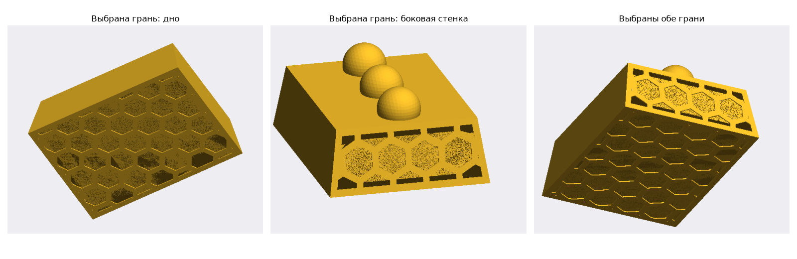

# Соты в модели

Вы выбираете плоские грани модели, и каждая из них превращается в открытые
соты, как в Materialise Magics. Шестигранные ячейки идут от грани вглубь
модели, а от остальной поверхности их отделяет стенка заданной толщины.
Модель становится легче и тратит меньше материала при печати, наружная
поверхность остаётся без изменений.



## Установка

Нужен Python 3.10 или новее.

```
pip install -r requirements.txt
```

## Использование

1. Экспортируйте модель из exocad в STL (например, результат Model Creator).
   Модель должна быть замкнутой.
2. Посмотрите, какие плоские грани есть у модели:

   ```
   python honeycomb.py model.stl --list-planes
   ```

   ```
    №   площадь, мм²   нормаль               центр, мм
    1        1200.0   ( 0.00  0.00 -1.00)   (   0.0    0.0    0.0)
    2         345.1   ( 0.98  0.00  0.20)   (  18.8    0.0    5.9)
   ```

   Нормаль показывает, куда смотрит грань: `(0 0 -1)` — вниз, `(1 0 0)` — вправо по X.
3. Выберите грани по номерам:

   ```
   python honeycomb.py model.stl model_honeycomb.stl --planes 1,2
   ```

   Без `--planes` соты строятся на дне модели, `--planes auto` выбирает самую
   большую грань.
4. Откройте `model_honeycomb.stl` в exocad или в программе для печати.

Подходят только наружные плоские грани — те, за плоскость которых модель
нигде не выступает: дно, срезы основания, плоские боковые стенки.

## Параметры

| Параметр | По умолчанию | Описание |
|---|---|---|
| `--wall` | 1.2 | Толщина наружной стенки, мм |
| `--cell` | 5 | Размер ячейки между параллельными гранями, мм |
| `--inner-wall` | 1.2 | Толщина стенок между ячейками, мм |
| `--planes` | bottom | Грани под соты: номера через запятую, `auto` или `bottom` |
| `--depth` | вся модель | Глубина сот от грани, мм |
| `--perf-diameter` | 0 | Диаметр перфорации внутренних стенок, мм (0 — без неё) |
| `--perf-height` | у грани | Расстояние от грани до центра перфорации, мм |
| `--layer` | 0.2 | Шаг построения, мм. Меньше — точнее внутренние своды, но дольше |

Пример с ограничением глубины и перфорацией:

```
python honeycomb.py model.stl out.stl --planes 1 --wall 1.5 --cell 4 --depth 10 --perf-diameter 1
```

Если выбрать несколько граней, задайте `--depth`: иначе соты от разных граней
пройдут через всю модель и пересекутся.

## Тесты

```
pip install pytest
python -m pytest
```
